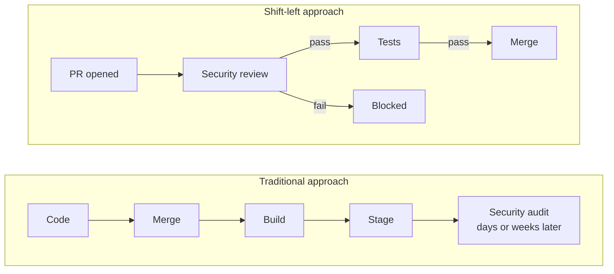
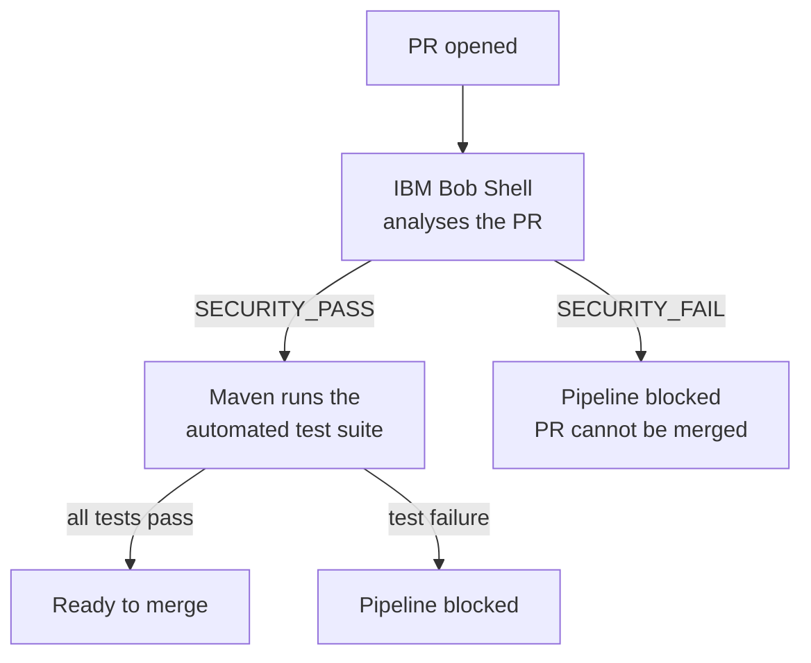

# Security Shift-Left with IBM Bob

This repository is a **demo application** that shows how [IBM Bob](https://bob.ibm.com) can be integrated into a CI/CD pipeline to implement **security shift-left**: the practice of moving security checks as early as possible in the development lifecycle, before code is merged into the main branch.

## What is Security Shift-Left?

Traditional security reviews happen late in the delivery cycle: during penetration testing, staging audits, or even after a production incident. **Shift-left** inverts this approach by running security analysis automatically on every pull request, giving developers immediate feedback on vulnerabilities while the context is still fresh and the cost of fixing is low.



## How IBM Bob is used in this pipeline

The CI/CD pipeline defined in [`.github/workflows/ci.yml`](.github/workflows/ci.yml) triggers on every pull request and runs two sequential jobs:



## Repository structure

```
.
├── .bob/
│   └── skills/
│       └── pr-security-review/
│           ├── SKILL.md               # Bob skill: security analysis instructions
│           └── collect-pr-diff.sh     # Script: collects the PR diff via git
├── .github/
│   └── workflows/
│       └── ci.yml                     # GitHub Actions pipeline
└── src/
    ├── main/java/com/ibm/secure/demo/
    │   ├── CustomerResource.java       # REST endpoints: /users/search, /users/register
    │   ├── Customer.java
    │   └── UserAccount.java
    └── test/java/com/ibm/secure/demo/
        └── CustomerResourceTest.java  # Automated tests (Quarkus + RestAssured)
```

## Prerequisites

To run the pipeline you need:

1. An **IBM Bob API key** (scope: *Inference*) generated from the [IBM Bob portal](https://bob.ibm.com)
2. A `security` label created in your GitHub repository (Issues > Labels > New label, name: `security`)
3. The following secrets added to your GitHub repository (**Settings > Secrets and variables > Actions**):

| Secret | Description |
|--------|-------------|
| `BOBSHELL_API_KEY` | IBM Bob API key (scope: Inference) |
| `GITHUB_TOKEN` | Provided automatically by GitHub Actions - no setup needed |

## Running locally

Start the application in dev mode:

```bash
./mvnw quarkus:dev
```

Run the test suite:

```bash
./mvnw test
```

Run the security review skill manually from Bob IDE:

```
/pr-security-review [base-branch]
```
