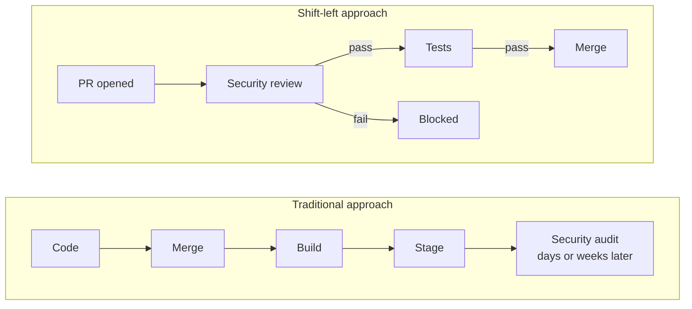
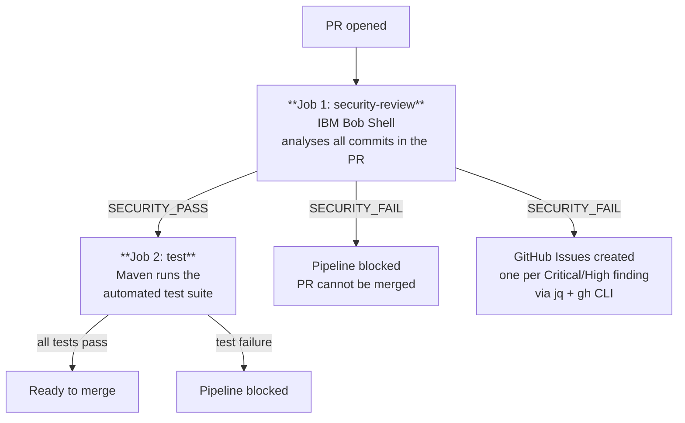

# Security Shift-Left with IBM Bob

This repository is a **demo application** that shows how [IBM Bob](https://bob.ibm.com) can be integrated into a CI/CD pipeline to implement **security shift-left**: the practice of moving security checks as early as possible in the development lifecycle, before code is merged into the main branch.

## What is Security Shift-Left?

Traditional security reviews happen late in the delivery cycle: during penetration testing, staging audits, or even after a production incident. **Shift-left** inverts this approach by running security analysis automatically on every pull request, giving developers immediate feedback on vulnerabilities while the context is still fresh and the cost of fixing is low.



## How IBM Bob is used in this pipeline

The CI/CD pipeline defined in [`.github/workflows/ci.yml`](.github/workflows/ci.yml) triggers on every pull request and runs two sequential jobs:



### Job 1 - Security Review (IBM Bob)

IBM Bob Shell is installed on the runner and invoked in **non-interactive mode** using the custom skill [`pr-security-review`](.bob/skills/pr-security-review/SKILL.md).

The skill performs the following steps:

1. Collects the full diff of every commit in the PR via [`collect-pr-diff.sh`](.bob/skills/pr-security-review/collect-pr-diff.sh)
2. Reads every changed source file in full
3. Analyses the code against a security checklist covering: hardcoded secrets, SQL injection, plaintext passwords, insecure service bindings, missing input validation, CORS misconfigurations, weak cryptography, and more
4. Produces a structured findings report with severity levels (Critical / High / Medium / Low)
5. Emits a final `SECURITY_PASS` or `SECURITY_FAIL` verdict
6. Emits a machine-readable `SECURITY_ISSUES_JSON` line containing all Critical/High findings as a JSON array

If any **Critical or High** severity issue is found (CVSS >= 7.0):
- The pipeline is **blocked** and the PR cannot be merged
- A **GitHub Issue is automatically created** for each finding, with description, file location, and recommended fix, assigned to the PR author
- The full Bob report is uploaded as a GitHub Actions artifact and retained for 30 days

The issue creation step uses `jq` to parse the JSON array emitted by Bob and the GitHub CLI (`gh`) to open each issue with the `security` label.

### Job 2 - Automated Tests

Runs only if the security review passes. Executes the Maven test suite (`./mvnw test`) and uploads the Surefire reports as an artifact.

## Repository structure

```
.
├── .bob/
│   └── skills/
│       └── pr-security-review/
│           ├── SKILL.md               # Bob skill: security analysis instructions
│           └── collect-pr-diff.sh     # Script: collects the PR diff via git
├── .github/
│   └── workflows/
│       └── ci.yml                     # GitHub Actions pipeline
└── src/
    ├── main/java/com/ibm/secure/demo/
    │   ├── CustomerResource.java       # REST endpoints: /users/search, /users/register
    │   ├── Customer.java
    │   └── UserAccount.java
    └── test/java/com/ibm/secure/demo/
        └── CustomerResourceTest.java  # Automated tests (Quarkus + RestAssured)
```

## Prerequisites

To run the pipeline you need:

1. An **IBM Bob API key** (scope: *Inference*) generated from the [IBM Bob portal](https://bob.ibm.com)
2. A `security` label created in your GitHub repository (Issues > Labels > New label, name: `security`)
3. The following secrets added to your GitHub repository (**Settings > Secrets and variables > Actions**):

| Secret | Description |
|--------|-------------|
| `BOBSHELL_API_KEY` | IBM Bob API key (scope: Inference) |
| `GITHUB_TOKEN` | Provided automatically by GitHub Actions - no setup needed |

## Running locally

Start the application in dev mode:

```bash
./mvnw quarkus:dev
```

Run the test suite:

```bash
./mvnw test
```

Run the security review skill manually from Bob IDE:

```
/pr-security-review [base-branch]
```
